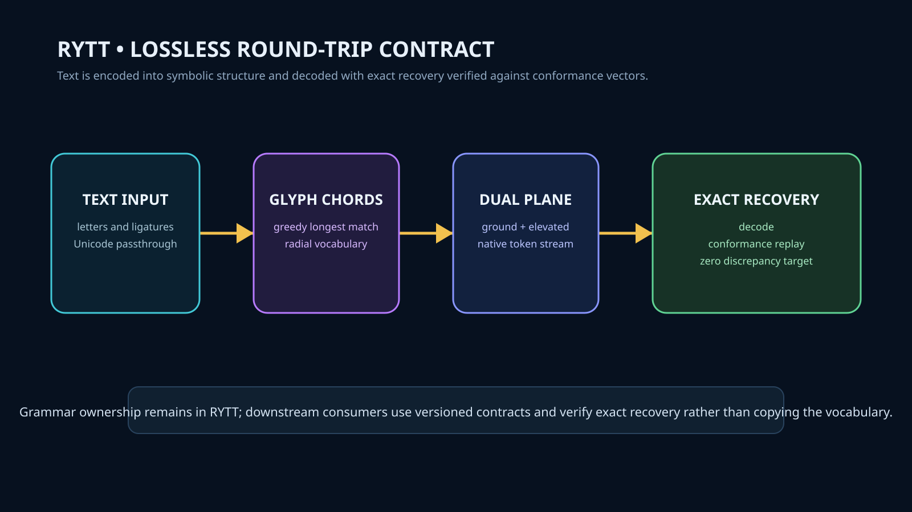

# RYTT — Sovereign Semiotics

A formal, lossless, reversible grammar mapping language to radial glyph chords and dual-plane native tokens.



## System Role & Authority

`RYTT-Sovereign-Semiotics` is the canonical owner and specification authority for the RYTT semiotic grammar, PUA allocation planes, and dual-plane token serialization.

- **Standalone Grammar**: Downstream projects (`4Leibniz`, `Res-Nova`, `MVPC-X`, `chyren-aeon`) consume RYTT via versioned JSON interfaces and bridge contracts. They do not fork, duplicate, or alter the token vocabulary.
- **Pure Reversibility**: The core invariant is zero-discrepancy round-trip (`decode(encode(text)) == text`) across all Unicode text without exception.
- **Dual-Plane Allocation**: Maps 52 genome bases and 46 ligatures across Private Use Areas:
  - Ground Plane: `U+E000` (`z = 0`)
  - Elevated Plane: `U+E800` (`z = 25`)

## Cross-Repository Coordination

- **4Leibniz (Issue #10)**: Bound via `integration/4leibniz_bridge.json` for symbolic notation and interchange of Lean theorem metadata.
- **Res-Nova (Issue #48)**: Ingests select manuscript passages strictly as benchmark corpora to evaluate compression and token density.
- **MVPC-X (Issue #7)**: Audits serialized token envelopes and executes independent conformance replay against `conformance/vectors.json`.

## Specification & Conformance

- **Specification**: `src/rytt/data/rytt-spec-v0.1.0.json`
- **Conformance Suite**: 7 standard test vectors in `conformance/vectors.json` verifying:
  - Empty string
  - Mixed-case ASCII
  - Chord-rich English
  - Whitespace preservation
  - Symbol preservation
  - Unicode passthrough
  - Comprehensive character sets
- **Rust Engine**: High-performance WASM and native core in `crates/rytt-core`.

## Verification

```bash
# Run pytest verification suite
pytest tests/

# Validate conformance vectors
python -m rytt.cli verify conformance/vectors.json
```
