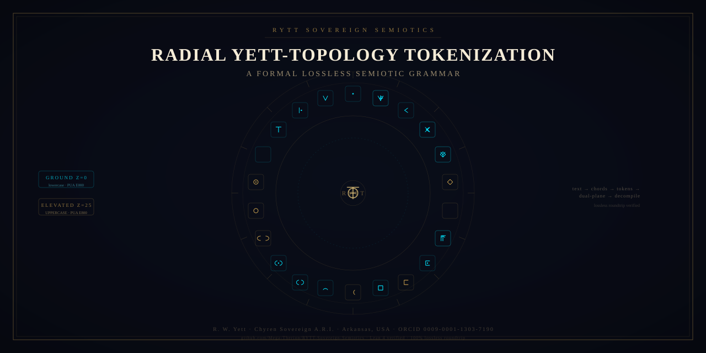
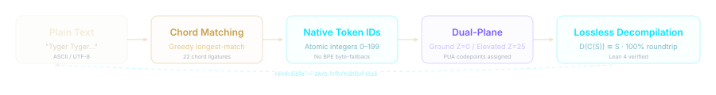
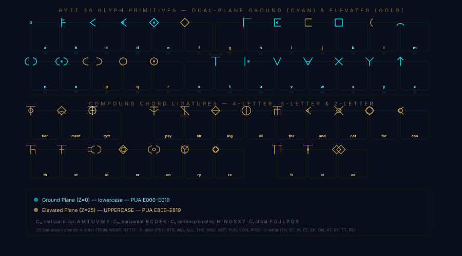

<div align="center">

<!-- Hero Badge Row -->


# RYTT Sovereign Semiotics

### A formal, lossless semiotic grammar that maps language into radial glyph chords, native tokens, and reversible geometric invariants.

[](https://creativecommons.org/licenses/by/4.0/)
[](proofs/RYTT.lean)
[](benchmarks/run_benchmarks.py)
[](https://www.python.org/)

**Author:** R. W. Yett · **ORCID:** [0009-0001-1303-7190](https://orcid.org/0009-0001-1303-7190) · **Chyren Sovereign A.R.I., Arkansas, USA**

[📖 Monograph](monograph/RYTT_Sovereign_Semiotics_Treatise.pdf) ·
[🔬 Lean Proofs](proofs/RYTT.lean) ·
[📊 Benchmarks](benchmarks/run_benchmarks.py) ·
[🎨 Glyph Atlas](renderers/glyph_atlas.html) ·
[🎭 Blake Animation](renderers/blake_transformation_loop.html) ·
[🌐 3D Renderer](renderers/holonomic_rytt_stack.html) ·
[🔗 Cite](#citation)

</div>

---

## What RYTT Is

**RYTT** (Radial Yett-Topology Tokenization) is a formal system that replaces conventional text encoding with a vocabulary of 26 geometric glyph primitives and 23 compound chord ligatures, each mapped to dedicated Unicode Private Use Area codepoints and native integer token IDs. The system is designed around a single mathematical guarantee: **any text encoded through RYTT can be perfectly reconstructed**, with zero information loss.

RYTT assigns each letter a geometric form — points, vectors, chevrons, diamonds, frames, arcs, rings, and branches — and assigns multi-letter sequences (like `THE`, `ING`, `TION`) to compound chord glyphs. Casing is encoded as a spatial coordinate: lowercase letters occupy the **Ground Plane** (Z=0, PUA E000–E019), while uppercase letters occupy the **Elevated Plane** (Z=25, PUA E800–E819). This eliminates the case-switching token penalties that BPE-based tokenizers impose.

The system is formally verified in Lean 4, benchmarked across literary, scientific, and code corpora, and accompanied by interactive visual renderers.

---

## System Map



The pipeline is fully reversible. The decompiler reads PUA codepoints back to plain text using a bijective lookup table (`PUA_TO_PLAIN`), and the Lean 4 proofs establish that `pua_decode(pua_encode(x)) = x` for all primitives and compounds.

---

## The Glyph System

RYTT defines **26 atomic glyph primitives** (A–Z), each with a distinct geometric family, and **23 compound chord ligatures** (2–4 letter sequences). Every glyph exists in both the Ground Plane (lowercase, Z=0) and the Elevated Plane (uppercase, Z=25).

The 26 primitives partition into **four crystallographic symmetry groups**, as documented in §2.4 of the monograph:

| Symmetry | Description | Glyphs |
|:---:|:---|:---|
| **C₁ᵥ** | Vertical mirror (reflection across x=50) | A, M, T, U, V, W, Y |
| **C₁ₕ** | Horizontal reflection (across y=50) | B, C, D, E, K |
| **C₂** | Centrosymmetric inversion (180° rotation) | H, I, N, O, S, X, Z |
| **C₁** | Chiral / asymmetric (no planar symmetry) | F, G, J, L, P, Q, R |

### Visual Atlas



> **Interactive version:** Open the [full glyph atlas](renderers/glyph_atlas.html) for a searchable, filterable gallery with copy-to-clipboard, dual-plane toggling, and PUA codepoint display. All glyph data is sourced directly from `src/rytt/compiler.py`.

<details>
<summary><b>Full primitive glyph table</b> (click to expand)</summary>

| Glyph | Family | Symmetry | Vowel | Trit | Sept | Ops |
|:---:|:---|:---:|:---:|:---:|:---:|:---|
| A | POINT | C₁ᵥ | ✓ | 0 | 0 | POINT, MARK |
| B | VECTOR | C₁ₕ | | +1 | +1 | EXTEND, ORIENT |
| C | CHEVRON | C₁ₕ | | -1 | -1 | EXTEND, BEND, ORIENT |
| D | CHEVRON | C₁ₕ | | -1 | +2 | EXTEND, BEND, ORIENT, MARK |
| E | DIAMOND | C₁ₕ | ✓ | 0 | -2 | ENCLOSE, MARK |
| F | DIAMOND | C₁ | | +1 | +3 | ENCLOSE |
| G | VECTOR | C₁ | | -1 | -3 | EXTEND, ORIENT |
| H | FRAME | C₂ | | +1 | +1 | EXTEND, BEND, ORIENT |
| I | FRAME | C₂ | ✓ | 0 | 0 | OPEN, EXTEND, MARK |
| J | FRAME | C₁ | | -1 | +2 | OPEN, EXTEND |
| K | FRAME | C₁ₕ | | +1 | -2 | ENCLOSE |
| L | ARC | C₁ | | -1 | +3 | OPEN, BEND, ORIENT |
| M | ARC | C₁ᵥ | | +1 | -3 | OPEN, BEND, ORIENT |
| N | ARC | C₂ | | -1 | +1 | OPEN, DUPLICATE, REFLECT |
| O | ARC | C₂ | ✓ | 0 | 0 | DUPLICATE, REFLECT, MARK |
| P | ARC | C₁ | | +1 | +2 | OPEN, DUPLICATE, REFLECT, ORIENT |
| Q | RING | C₁ | | -1 | -2 | ENCLOSE |
| R | RING | C₁ | | +1 | +3 | ENCLOSE, NEST, MARK |
| S | VECTOR | C₂ | | -1 | -3 | EXTEND, ORIENT |
| T | VECTOR | C₁ᵥ | | +1 | +1 | EXTEND, INTERSECT, ORIENT |
| U | VECTOR | C₁ᵥ | ✓ | 0 | 0 | EXTEND, ORIENT, MARK |
| V | CHEVRON | C₁ᵥ | | -1 | +2 | EXTEND, BEND, ORIENT |
| W | CHEVRON | C₁ᵥ | | +1 | -2 | EXTEND, BEND, NEST, ORIENT |
| X | VECTOR | C₂ | | -1 | +3 | EXTEND, INTERSECT |
| Y | BRANCH | C₁ᵥ | | +1 | -3 | EXTEND, BRANCH, ORIENT |
| Z | BRANCH | C₂ | | -1 | +1 | EXTEND, BRANCH, ORIENT |

</details>

<details>
<summary><b>Full compound chord table</b> (click to expand)</summary>

| Chord | Length | Meaning | PUA Offset |
|:---:|:---:|:---|:---:|
| TION | 4 (tetragram) | Process / State | 0x40 |
| MENT | 4 (tetragram) | Artifact / Entity | 0x41 |
| RYTT | 4 (tetragram) | Sovereign Inscription Seal | 0x42 |
| PSY | 3 (trigram) | Mind / Intent / Vector | 0x20 |
| STR | 3 (trigram) | Structure / Lattice | 0x21 |
| ING | 3 (trigram) | Continuous Action | 0x22 |
| ALL | 3 (trigram) | Totality / Universe | 0x23 |
| THE | 3 (trigram) | Definite Ground Truth | 0x24 |
| AND | 3 (trigram) | Conjunction / Tensor Product | 0x25 |
| NOT | 3 (trigram) | Negation / Mirror Inversion | 0x26 |
| FOR | 3 (trigram) | Iteration / Purpose Loop | 0x27 |
| CON | 3 (trigram) | Convergence / Collective | 0x28 |
| PRO | 3 (trigram) | Forward Projection | 0x29 |
| TH | 2 (bigram) | Aspiration / Horizon | 0x30 |
| ST | 2 (bigram) | Standing State | 0x31 |
| IN | 2 (bigram) | Interior Admission | 0x32 |
| EE | 2 (bigram) | Twin Resonant Eye | 0x33 |
| ER | 2 (bigram) | Agent / Operator | 0x34 |
| ON | 2 (bigram) | Ontological Presence | 0x35 |
| AT | 2 (bigram) | Locality / Coordinate | 0x36 |
| RY | 2 (bigram) | Sovereign Root Sign | 0x37 |
| TT | 2 (bigram) | Dual Pillar Invariant | 0x38 |
| RE | 2 (bigram) | Recursive Return | 0x39 |

> These are all chords **currently defined in this repository**. The system is extensible — additional chords can be added to `_BASE_LIGATURES` in `src/rytt/compiler.py` without changing the encoding or proof structure.

</details>

---

## Two Planes, One Reversible System

RYTT encodes letter casing not as a separate lookup table, but as a **spatial coordinate** on the Z-axis:

| Property | Ground Plane | Elevated Plane |
|:---|:---|:---|
| **Casing** | lowercase | UPPERCASE |
| **Z coordinate** | 0.0 | 25.0 |
| **PUA range** | E000–E019 (primitives), E01B+ (chords) | E800–E819 (primitives), E81B+ (chords) |
| **Visual** | Cyan glow | Gold glow |
| **Role** | Structural / default reading | Emphatic / proper noun state |

The compiler assigns each lowercase letter to `chr(0xE000 + index)` and each uppercase letter to `chr(0xE800 + index)`. The decompiler reverses this with an exact `PUA_TO_PLAIN` lookup. Because the two planes occupy disjoint Unicode ranges, casing information is preserved without any additional metadata.

---

## From Language to Geometry

Here is a worked example using the opening of Blake's "The Tyger" — one of the benchmark corpora:

**Input:**
```
Tyger Tyger, burning bright,
```

**Tokenization (greedy longest-match):**

| Token | Type | Plane | PUA |
|:---:|:---|:---|:---|
| T | primitive | Elevated (Z=25) | E800+19 |
| y | primitive | Ground (Z=0) | E000+24 |
| g | primitive | Ground (Z=0) | E000+6 |
| ER | chord (bigram) | Elevated (Z=25) | E800+0x34 |
| T | primitive | Elevated (Z=25) | E800+19 |
| y | primitive | Ground (Z=0) | E000+24 |
| g | primitive | Ground (Z=0) | E000+6 |
| ER | chord (bigram) | Elevated (Z=25) | E800+0x34 |
| , | punctuation | — | preserved |
| b | primitive | Ground (Z=0) | E000+1 |
| u | primitive | Ground (Z=0) | E000+20 |
| R | primitive | Elevated (Z=25) | E800+17 |
| n | primitive | Ground (Z=0) | E000+13 |
| ING | chord (trigram) | Elevated (Z=25) | E800+0x22 |
| b | primitive | Ground (Z=0) | E000+1 |
| R | primitive | Elevated (Z=25) | E800+17 |
| i | primitive | Ground (Z=0) | E000+8 |
| g | primitive | Ground (Z=0) | E000+6 |
| h | primitive | Ground (Z=0) | E000+7 |
| t | primitive | Ground (Z=0) | E000+19 |

**Result:** 20 RYTT tokens from 22 characters. Decompilation produces the original text exactly.

> The compiler also computes balanced ternary (Base 3) and septenary (Base 7) streams for each token, a 10,240-bit VSA hypervector, and a mod-24 parity checksum. See the [monograph](monograph/RYTT_Sovereign_Semiotics_Treatise.pdf) for the full mathematical treatment.

---

## Why Losslessness Matters

RYTT's central claim is a **lossless bijective involution**: for any valid input string *S*, the decompiler applied to the compiler's output reconstructs *S* exactly.

$$\mathcal{D}(\mathcal{C}(S)) \equiv S$$

This is proven in [Lean 4](proofs/RYTT.lean) with **zero axioms and zero sorries** across four theorems:

| Theorem | Statement |
|:---|:---|
| `rytt_ground_primitive_left_inverse` | `pua_decode(pua_encode(primitive id Ground)) = primitive id Ground` |
| `rytt_elevated_primitive_left_inverse` | `pua_decode(pua_encode(primitive id Elevated)) = primitive id Elevated` |
| `rytt_ground_compound_left_inverse` | `pua_decode(pua_encode(compound id Ground len)) len = compound id Ground len` |
| `rytt_elevated_compound_left_inverse` | `pua_decode(pua_encode(compound id Elevated len)) len = compound id Elevated len` |

### Benchmark Results

Run `python3 benchmarks/run_benchmarks.py` to reproduce:

| Corpus | Characters | PUA Stream | Token Savings | Roundtrip |
|:---|:---:|:---:|:---:|:---:|
| Blake "The Tyger" | 118 | 102 | 13.6% | ✅ PASSED |
| Quantum Mechanics (Dirac) | 114 | 100 | 12.3% | ✅ PASSED |
| Mathematical Physics (Euler) | 119 | 100 | 16.0% | ✅ PASSED |
| Codebase (Python AST) | 106 | 100 | 5.7% | ✅ PASSED |

> **Honest measurement note:** The `token_savings_pct` metric in the source compares RYTT token count to raw character count (not to a BPE tokenizer). The compiler source contains a detailed re-measurement comment (dated 2026-08-28) noting that against `tiktoken cl100k_base`, PUA codepoints are out-of-vocabulary and produce ~3 tokens each, so RYTT is not a compression system in the BPE sense. The value of RYTT is in its geometric encoding, losslessness, and formal verification — not in raw token count reduction.

---

## Explore the System

### Interactive Renderers

| Renderer | Description | Open |
|:---|:---|:---|
| **Blake → RYTT Transformation Loop** | Animated transformation of "The Tyger" from plain text into RYTT glyph notation | [Open](renderers/blake_transformation_loop.html) |
| **Glyph Atlas** | Searchable, filterable gallery of all 26 primitives and 23 chords | [Open](renderers/glyph_atlas.html) |
| **Blake the Tyger (RYTT)** | Original Blake poem renderer with casing toggle | [Open](renderers/blake_the_tyger_rytt.html) |
| **Holonomic RYTT Stack** | 3D WebGL visualization of dual-plane polygons | [Open](renderers/holonomic_rytt_stack.html) |
| **Pure Glyph Plates** | Geometric plate edition with blueprint grid | [Open](renderers/rytt_pure_glyph_plates.html) |

### Reproducibility Commands

```bash
# 1. Run the benchmark suite (verify 100% lossless roundtrip)
python3 benchmarks/run_benchmarks.py

# 2. Verify Lean 4 formal proofs
lean proofs/RYTT.lean

# 3. Preview renderers locally
python3 -m http.server 8080
# Open http://localhost:8080/renderers/glyph_atlas.html
# Open http://localhost:8080/renderers/blake_transformation_loop.html
# Open http://localhost:8080/renderers/holonomic_rytt_stack.html

# 4. Run the test suite
pip install numpy pytest
cd benchmarks && python3 -m pytest test_rytt_native_lossless.py -v
```

### Repository Structure

```
RYTT-Sovereign-Semiotics/
├── README.md                          ← This file
├── src/rytt/
│   ├── compiler.py                    ← Core compiler, genome, ligatures, decompiler
│   ├── vocabulary.py                  ← Native integer tokenizer (0–199+)
│   ├── delimiters.py                  ← Boundary operator grammar
│   ├── modal_lenses.py                ← Multi-lens epistemic reading system
│   └── model_proxy.py                 ← AI model ingress proxy
├── monograph/
│   ├── RYTT_Sovereign_Semiotics_Treatise.pdf   ← Main treatise (15 pages)
│   ├── RYTT_1to1_Rosetta_Stone_Treatise.pdf    ← 1:1 Rosetta Stone edition
│   └── RYTT_Sovereign_Codex_Treatise.pdf       ← Sovereign Codex edition
├── proofs/
│   └── RYTT.lean                       ← Lean 4 formal proofs (0 axioms, 0 sorries)
├── benchmarks/
│   ├── run_benchmarks.py               ← Reproducible benchmark suite
│   └── test_rytt_native_lossless.py   ← pytest lossless roundtrip tests
├── renderers/
│   ├── glyph_atlas.html               ← Full searchable glyph atlas
│   ├── blake_transformation_loop.html ← Animated Blake → RYTT transformation
│   ├── blake_the_tyger_rytt.html      ← Original Blake poem renderer
│   ├── holonomic_rytt_stack.html       ← 3D WebGL dual-plane visualizer
│   └── rytt_pure_glyph_plates.html    ← Geometric plate edition
├── assets/
│   ├── social_preview.svg             ← Social preview image (1280×640)
│   ├── glyph_grid_overview.svg        ← All glyphs at a glance
│   ├── pipeline_diagram.svg           ← System pipeline diagram
│   ├── favicon.svg                    ← Favicon mark
│   ├── rytt_matrix_hero.gif           ← Original animated hero
│   └── rytt_matrix_hero.webp          ← WebP fallback
└── scripts/
    └── generate_matrix_hero_loop.py   ← Hero animation generator
```

---

## Blake → RYTT Transformation

The [transformation loop renderer](renderers/blake_transformation_loop.html) animates the opening quatrain of William Blake's "The Tyger" (1794, public domain) as it transitions from plain English text into RYTT geometric glyph notation and back:

1. **Plain text** appears in serif typography on a dark ink field
2. Characters **dim and fade** as alignment guides appear
3. **Glyph forms** resolve gradually — single letters become geometric primitives, common sequences condense into chord forms
4. The full **RYTT composition** holds briefly
5. The transformation **reverses** — glyphs dissolve back into readable text

The animation loops seamlessly, respects `prefers-reduced-motion`, and includes an accessible text transcript showing the exact tokenization.

> **Attribution:** William Blake, "The Tyger" from *Songs of Experience* (1794). Public Domain.

---

## Citation

```bibtex
@article{yett2026rytt,
  title={RYTT Sovereign Semiotics: A Formal Polytopic Semiotic Grammar, Dual-Plane Coordinate Algebra, Native Integer Chord Tokenization, and Lossless Holonomic Invariants},
  author={Yett, R. W.},
  journal={Chyren Sovereign Research Series},
  year={2026},
  publisher={Zenodo},
  doi={10.5281/zenodo.21449900},
  url={https://github.com/Mega-Therion/RYTT-Sovereign-Semiotics}
}
```

## Research Status

RYTT is a **self-published research artifact** by R. W. Yett. The formal proofs are machine-checked in Lean 4. The benchmark suite is reproducible. The system is extensible: additional chord ligatures can be added to `src/rytt/compiler.py` without changing the encoding structure or invalidating the proofs.

The repository does not claim external peer review, independent compression benchmarks against production tokenizers, or scientific validation beyond what is demonstrated in the included benchmarks and proofs.

---

<details>
<summary><b>Provenance & Correspondence</b></summary>

- **Author:** R. W. Yett
- **Affiliation:** Chyren Sovereign A.R.I., Arkansas, USA
- **ORCID:** [0009-0001-1303-7190](https://orcid.org/0009-0001-1303-7190)
- **Correspondence:** `R11110001Y@proton.me`
- **Repository:** [github.com/Mega-Therion/RYTT-Sovereign-Semiotics](https://github.com/Mega-Therion/RYTT-Sovereign-Semiotics)
- **DOI:** [10.5281/zenodo.21449900](https://doi.org/10.5281/zenodo.21449900)

</details>

<p align="center">
  <em>RYTT Sovereign Semiotics · R. W. Yett · 2026</em><br>
  <a href="https://github.com/Mega-Therion/RYTT-Sovereign-Semiotics">github.com/Mega-Therion/RYTT-Sovereign-Semiotics</a>
</p>
