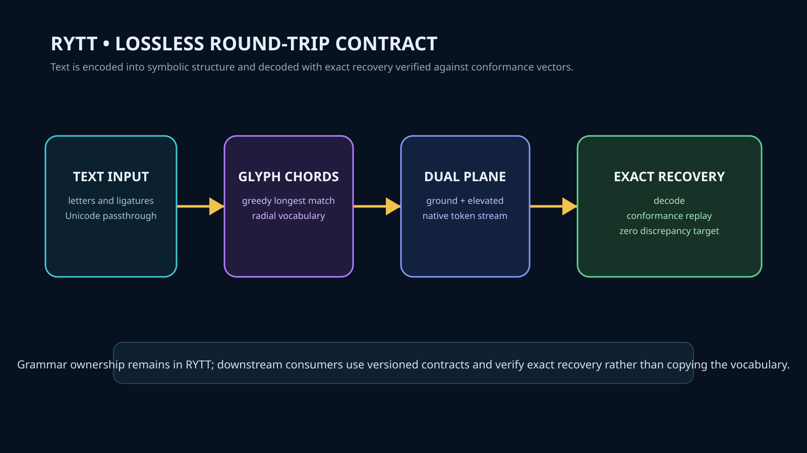

# RYTT

<p align="left">
  <a href="https://github.com/Mega-Therion/RYTT-Sovereign-Semiotics/actions/workflows/ci.yml"></a>
  <a href="https://github.com/Mega-Therion/RYTT-Sovereign-Semiotics/actions/workflows/rytt-core-ci.yml"></a>
  <a href="proofs/RYTT_standalone.lean"></a>
  <a href="https://huggingface.co/datasets/ChyRho/rytt-sovereign-semiotics-benchmarks"></a>
  <a href="https://orcid.org/0009-0001-1303-7190"></a>
  <a href="https://rytt-sovereign-semiotics.vercel.app"></a>
  <a href="https://res-nova-atlas.vercel.app"></a>
  <a href="https://www.linkedin.com/in/r-w-yett/"></a>
  <a href="https://x.com/_chyrho_"></a>
</p>

A formal, lossless, reversible grammar mapping language to radial glyph chords and dual-plane native tokens.

The picture below is the contract. Text goes in. Glyph chords and a dual-plane token stream come out. Decode is required to return the same text. The Lean file checks the PUA round-trip of the chord constructors on bounded domains. The conformance vectors and the Rust tests check the compiler.



Live pages: [playground](https://rytt-sovereign-semiotics.vercel.app) and, in this repo, [`index.html`](index.html), [`web/playground.html`](web/playground.html), [`renderers/glyph_atlas.html`](renderers/glyph_atlas.html).

## What is checked, and what is only a possible use

The checked claim is `decode(encode(text)) == text` for the vectors and the proofs named below. It is not, by itself, a result about whether a language model tells the truth.

A possible use, not a result in this repository:

- **Token representation auditing**: RYTT's dual-plane allocation (`U+E000` ground / `U+E800` elevated) provides a formal, human-readable semiotic layer over LLM token vocabularies, enabling systematic comparison between model-internal and human-legible representations
- **Lossless round-trip as a safety primitive**: `decode(encode(text)) == text` for every Unicode text. The two character classes the display stream reserves (U+00B7, the literal-space marker, and the RYTT PUA range U+E000–U+F8FF) are written behind a one-character escape, so they decode to themselves. The Lean proofs cover the PUA round-trip of the chord constructors on bounded domains; the full compiler is checked by the conformance vectors and tests
- **Conformance, not a sycophancy study**: the 9 vectors in `conformance/vectors.json` check the grammar. The deductive sycophancy pilot is a different repository.
- **Formal Lean 4 standalone proof** (`proofs/RYTT_standalone.lean`): No Mathlib dependency. It checks the PUA round-trip of the chord constructors on bounded domains. The full compiler is checked by the conformance vectors and the tests.


## System Role & Authority

`RYTT-Sovereign-Semiotics` is the canonical owner and specification authority for the RYTT semiotic grammar, PUA allocation planes, and dual-plane token serialization.

- **Standalone Grammar**: Downstream projects (`4Leibniz`, `Res-Nova`, `MVPC-X`, `chyren-aeon`) consume RYTT via versioned JSON interfaces and bridge contracts. They do not fork, duplicate, or alter the token vocabulary.
- **Pure Reversibility**: The core invariant is zero-discrepancy round-trip (`decode(encode(text)) == text`) across all Unicode text. Source U+00B7 (the literal-space marker) and codepoints in the RYTT PUA range U+E000–U+F8FF are written behind the display escape ([SPECIFICATION.md §3.4](SPECIFICATION.md#34-display-escape)).
- **Dual-Plane Allocation**: Maps 52 genome bases and 46 ligatures across Private Use Areas:
  - Ground Plane: `U+E000` (`z = 0`)
  - Elevated Plane: `U+E800` (`z = 25`)

## Cross-Repository Coordination

- **4Leibniz (Issue #10)**: Bound via `integration/4leibniz_bridge.json` for symbolic notation and interchange of Lean theorem metadata.
- **Res-Nova (Issue #48)**: Ingests select manuscript passages strictly as benchmark corpora to evaluate compression and token density.
- **MVPC-X (Issue #7)**: an envelope-replay adapter was attempted and not merged. Its tests failed, including a fixture path that pointed at a local worktree. RYTT does not claim that audit is on MVPC-X main.

## Specification & Conformance

- **Specification**: `src/rytt/data/rytt-spec-v0.1.0.json`
- **Conformance Suite**: 9 test vectors in `conformance/vectors.json` verifying:
  - Empty string
  - Mixed-case ASCII
  - Chord-rich English
  - Whitespace preservation
  - Symbol preservation
  - Unicode passthrough
  - Comprehensive character sets
- **Rust Engine**: High-performance WASM and native core in `crates/rytt-core`.

## Verification

```bash
# Run pytest verification suite
pytest tests/

# Validate conformance vectors
python scripts/verify_conformance.py

# CLI (installed entry point `rytt`, module `rytt._cli`)
rytt encode "text"
rytt artifact-verify bundle.zip
```

## How this was built

R.W. Yett directs the work. Much of the code and prose was written with AI coding assistants; those commits carry `Co-Authored-By` trailers. The round-trip claim rests on the Lean file, the conformance vectors, and the tests.

---

*Part of the **Chyren · Ψ/Φ** constellation, built on the Psimodulo–Phimodus principle: one mind, invariant across substrates, operating as one integrated whole. Author: R.W. Yett · [github.com/Mega-Therion](https://github.com/Mega-Therion).*
